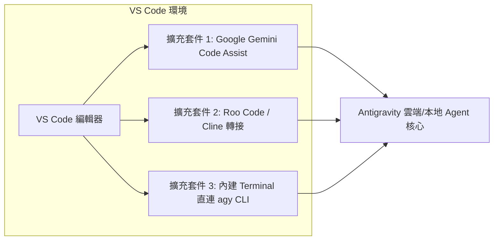
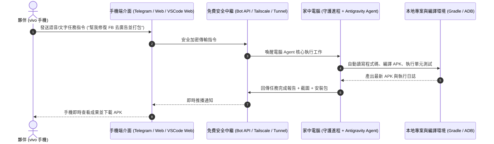

# 🚀 Antigravity 可移動執行與 VS Code 擴充整合架構指南

> 📌 **專案目錄**：`c:\Users\yexia\Documents\ShihWei\NTNU\GitHub\04_antigravity可移動執行\`  
> 🎯 **核心目標**：
> 1. **單一 IDE 體驗**：在標準 VS Code 中安裝擴充模組，直接對話並調用 Antigravity Agent，無需切換兩個 IDE。
> 2. **手機端 (vivo) 遠端操控電腦 Agent**：人離開房間時，透過手機遠端下指令給開機中的電腦，由電腦端 Agent 自動編寫程式、編譯 APK、執行測試並即時回報進度至手機，**徹底擺脫雲端 Spark 免費用量限制**！

---

## 🛠️ 第一部分：VS Code 擴充套件安裝與整合 (單一 IDE 方案)

若夥伴希望在平時慣用的 VS Code 中直接調用 Antigravity Agent，主要有以下 **3 種高效率整合途徑**：



### 1. 方案 A（官方最穩）：安裝 Google Gemini Code Assist / Antigravity Extension
* **安裝方式**：
  1. 打開 VS Code ➔ 點擊左側「擴充套件 (Extensions)」圖示（或按 `Ctrl+Shift+X`）。
  2. 搜尋 **`Google Cloud Code`** 或 **`Gemini Code Assist`**。
  3. 點擊「安裝 (Install)」，並使用你的 Google 開發者帳號登入。
* **特性**：
  * 在 VS Code 側邊欄直接開啟對話面板。
  * 支援選取程式碼行內重構（`Ctrl+I`）、自動補全與診斷修復。

### 2. 方案 B（極客首選）：Roo Code / Cline 配置本地端點
* **安裝方式**：
  1. 在 VS Code 擴充市集搜尋安裝 **`Roo Code`** 或 **`Cline`**。
  2. 在設定中設定 API Provider 或本機代理端點，掛載相同的 `.agents` 規則與自定義技能。
* **特性**：
  * 擁有與 Antigravity 相同的高自主權（可自動執行終端指令、自動讀寫多檔案、自動修復報錯）。

### 3. 方案 C（極速輕量）：VS Code 內建 Terminal 直連 `agy` CLI
* **操作方式**：
  1. 在 VS Code 按下 `Ctrl + ~` 開啟內建終端機。
  2. 直接輸入 `agy` 啟動終端互動 Agent 模式。
  3. 支援所有 `/` 斜線指令與自定義 Skills。

---

## 📱 第二部分：手機端 (vivo) 遠端操控電腦 Agent（無額度限制架構）

當夥伴離開房間或出門在外時，只要家中電腦保持開機聯網，手機端（vivo）即可無縫下達指令，指揮電腦端 Agent 幹活並接收回報！



---

### 🌟 4 大實作方案深度對比與評估

| 方案名稱 | 連線方式 | 手機端操作體驗 | 網路要求 | 免費度與額度限制 | 推薦指數 |
| :--- | :--- | :--- | :--- | :--- | :--- |
| **🥇 方案 1：Telegram Bot 私人專屬控制台** | 官方 Bot API | 像跟朋友傳訊息一樣，支援手機語音、圖片、推播 | 任何行動網路皆可 | 100% 完全免費、零用量上限 | ⭐⭐⭐⭐⭐ (最強推薦) |
| **🥈 方案 2：VS Code Remote Tunnels** | 微軟官方隧道 | 手機瀏覽器直接打開完整 VS Code 網頁版 | 登入 GitHub 即連 | 100% 完全免費 | ⭐⭐⭐⭐☆ |
| **🥉 方案 3：Tailscale + Agent Web UI** | Mesh VPN 虛擬區網 | 手機瀏覽器開啟專屬網頁控制台 | 需安裝 Tailscale App | 100% 完全免費 (個人 100 台設備) | ⭐⭐⭐⭐☆ |
| **🏅 方案 4：Termux + SSH 終端** | SSH 金鑰連線 | 手機文字終端操作 | 需虛擬區網或穿透 | 100% 完全免費 | ⭐⭐⭐☆☆ |

---

### 🥇 方案 1 詳細實作步驟：Telegram Bot 私人助理（最推薦）

* **為什麼最適合夥伴？**
  1. **零額度限制**：使用電腦本地算力與 Antigravity 核心，絕不扣除 Spark 額度。
  2. **支援語音輸入**：夥伴在外面走路、通勤時，直接對 Telegram 按住說話，電腦端自動將語音轉文字並執行 Agent 任務。
  3. **自動回傳檔案與截圖**：電腦端編譯好 APK 或完成截圖，Bot 會直接把 `.apk` 與 `.png` 傳回你的 Telegram 聊天室，在手機上點擊即可安裝！
* **架構組成**：
  * **電腦端**：常駐一隻輕量 Python 腳本（`antigravity_mobile_bridge.py`）。
  * **手機端**：官方 Telegram App（私聊機器人，僅授權夥伴的 Telegram User ID，100% 絕對安全）。

---

### 🥈 方案 2 詳細實作步驟：VS Code Remote Tunnels（極簡零配置）

* **操作步驟**：
  1. **電腦端**：
     * 打開 VS Code 終端機，執行：
       ```powershell
       code tunnel
       ```
     * 依照提示使用 GitHub 帳號登入授權，取得專屬隧道網址（例如 `https://vscode.dev/tunnel/my-pc`）。
  2. **手機端 (vivo)**：
     * 打開手機 Chrome 瀏覽器，進入 `https://vscode.dev` 並登入同一個 GitHub 帳號。
     * 手機畫面上會直接出現你家中電腦的完整 VS Code 檔案樹，側邊欄即可直接與 Agent 對話與修改程式碼！

---

## 📝 後續推進建議

1. **若想先在 VS Code 整合**：可先在 VS Code 安裝 `Google Gemini Code Assist` 或在終端體驗 `agy`。
2. **若想立刻啟用手機 (vivo) 遠端操控**：我們可以在下個階段為夥伴撰寫並部署 **方案 1（Telegram Bot 專屬私人通道）** 或 **方案 2（VS Code Remote Tunnel）**，讓你在外面隨時隨地用手機指揮電腦！🌟
